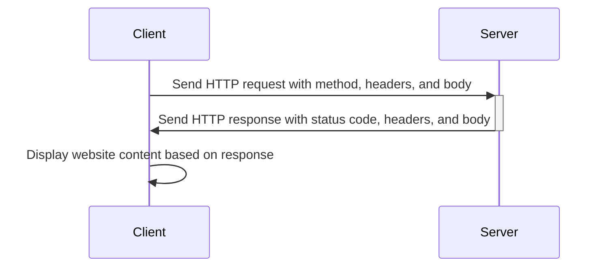

# How the web works

---

# How the web works / Components

- Client
- Server
- Protocols

<!--
    - Client: Computer that requests services
        - Browser
        - Mobile app
        - Desktop app
    - Server: Computer that provides services
        - Web server
        - Database server
        - Application server
    - Protocols: Rules for communication
        - HTTP
        - HTTPS
        - IP
        - WS, WSS
-->

---

# How the web works / HTTP request

<!--
    - Client requests a resource from the server
    - Server responds with the resource
    - Client displays the resource
-->

--- 

# How the web works / Request methods

- `GET` - Retrieve data
- `POST` - Create data
- `PUT` - Update data
- `DELETE` - Delete data

<FormDemo />

<!--
    - Explain methods
    - Explain devtools: network tab
    - Headers are used to send additional information and instructions
    - POST, PUT, DELETE are best used for sensitive data
    - GET is used for retrieving data and not safe for sensitive data
-->

---

# How the web works / HTTP response status codes

- `1xx` - Informational
- `2xx` - Success
- `3xx` - Redirection
- `4xx` - Client error
- `5xx` - Server error

<!--
    - EXAMPLES ON NEXT SLIDES: 200, 404
    - Explain status codes
    - 200 is the most common status code
    - 404 is the most common error status code
-->
---

# How the web works / 200

---

# How the web works / 404

---

# How the web works / HTML - CSS - JS

- Web pages use HTML for content and structure.
- CSS is used for styling.
- JavaScript adds interactivity and dynamic functionality.
- HTML is the foundation, while CSS and JavaScript enhance the web page.
- These technologies work together to create dynamic, interactive, and visually appealing web pages.

---

# How the web works / HTML - CSS - JS Demo

<CodepenEmbed slug-hash="abRYKqp" user="sjoerdb" height="400" />

---

# How the web works / Rendering a page

Source: https://medium.com/weekly-webtips/understand-dom-cssom-render-tree-layout-and-painting-9f002f43d1aa

---

# How the web works / Rendering a page

Source: https://web.dev/critical-rendering-path-render-tree-construction/

<!-- 
    - Explain DOM: Document Object Model
    - Explain CSSOM: CSS Object Model
    - Explain Render Tree: DOM + CSSOM
    - Explain Layout: Calculate the size and position of each element
    - Explain Paint: Draw the pixels to the screen
-->

