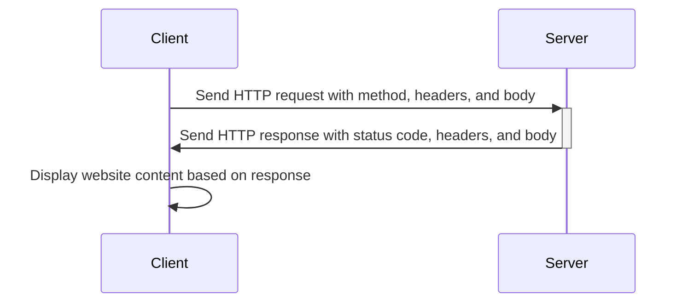
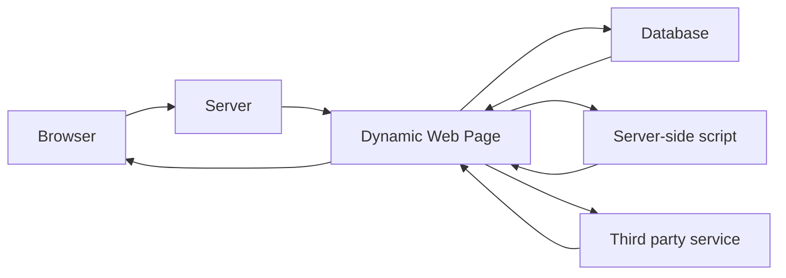
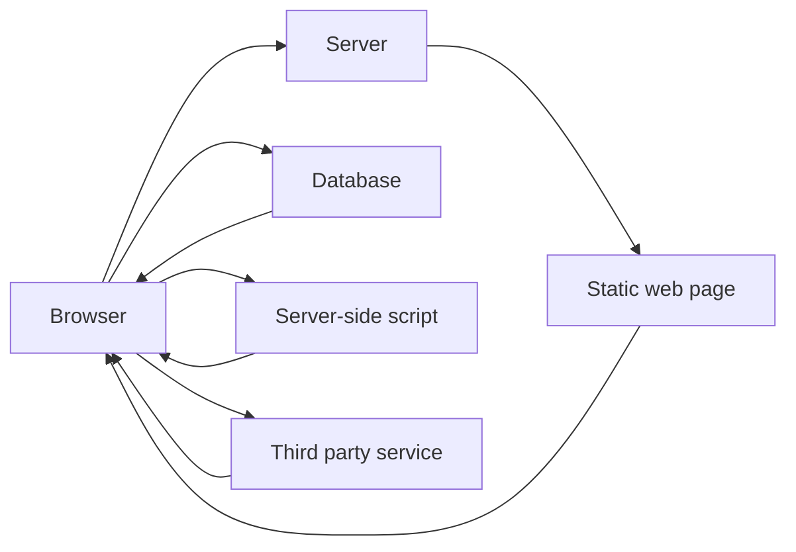

# How the web works

---

# How the web works / Components

- Client
- Server
- Protocols

---

# How the web works / HTTP request

--- 

# How the web works / Request methods

- `GET` - Retrieve data
- `POST` - Create data
- `PUT` - Update data
- `DELETE` - Delete data
- `OPTIONS` - Check available methods etc., executed automatically by the browser

<FormDemo />

---

# How the web works / HTML - CSS - JS

- Web pages use HTML for content and structure.
- CSS is used for styling.
- JavaScript adds interactivity and dynamic functionality.
- HTML is the foundation, while CSS and JavaScript enhance the web page.
- These technologies work together to create dynamic, interactive, and visually appealing web pages.
---

# How the web works / Server side rendering

---

# How the web works / Client side rendering

