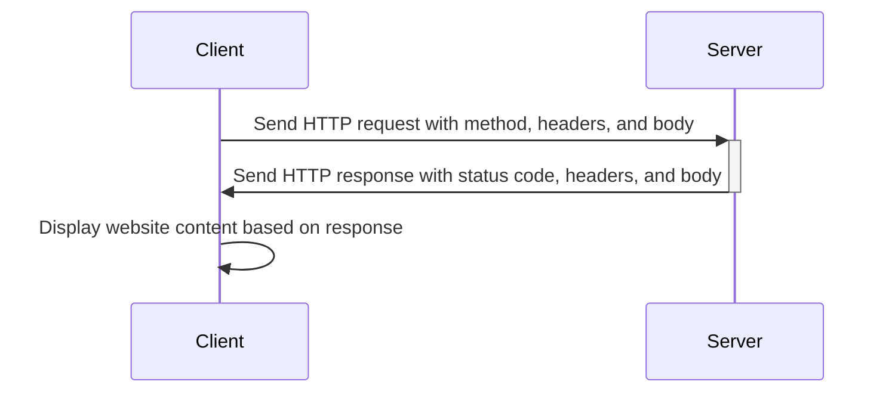
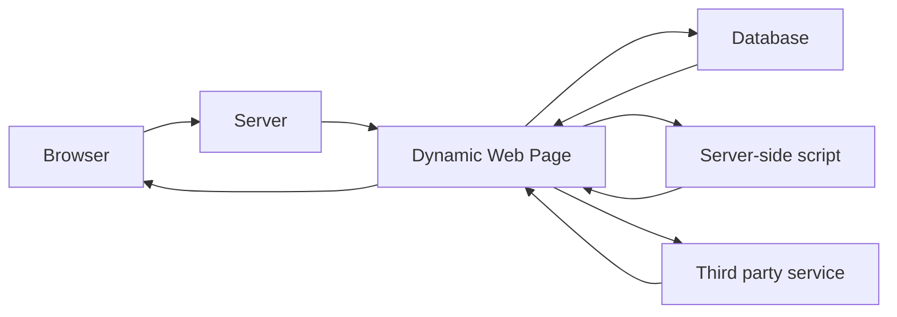

# How the web works

---

# How the web works / Components

- Client
- Server
- Protocols

---

# How the web works / HTTP request

--- 

# How the web works / Request methods

- `GET` - Retrieve data
- `POST` - Create data
- `PUT` - Update data
- `DELETE` - Delete data
- `OPTIONS` - Check available methods etc., executed automatically by the browser

<FormDemo />

---

# How the web works / HTTP response status codes

- `1xx` - Informational
- `2xx` - Success
- `3xx` - Redirection
- `4xx` - Client error
- `5xx` - Server error

---

# How the web works / 200

---

# How the web works / 404

---

# How the web works / HTML - CSS - JS

- Web pages use HTML for content and structure.
- CSS is used for styling.
- JavaScript adds interactivity and dynamic functionality.
- HTML is the foundation, while CSS and JavaScript enhance the web page.
- These technologies work together to create dynamic, interactive, and visually appealing web pages.

---

# How the web works / HTML - CSS - JS Demo

<CodepenEmbed slug-hash="abRYKqp" user="sjoerdb" height="400" />

---

# How the web works / Rendering a page

